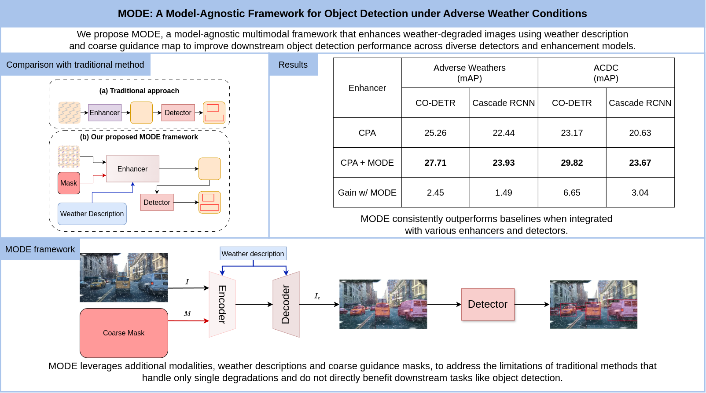

# [Pattern Recognition] MODE: A Model-agnostic Framework for Object Detection under Adverse Weather Conditions
Tuan-Duc Nguyen, Duc-Trong Le

<p align="center">
</img>
</p>

## Abstract
Despite substantial progress in object detection, deploying these models under adverse weather conditions remains a critical challenge, particularly in safety-sensitive applications such as autonomous driving, where robustness and reliability are paramount. Existing approaches typically rely on end-to-end training of enhancement and detection modules but are often constrained by their focus on single-weather degradations and a lack of explicit spatial or semantic guidance that directly benefit detection performance. To address these limitations, we propose MODE (Multimodal Learning for Object DEtection), an novel, unified and model-agnostic framework that explicitly integrates weather descriptions and object-location cues into the enhancement process. By incorporating these multimodal signals, MODE enables degradation-aware and region-aware enhancement, allowing the model to focus on semantically important regions and improving robustness across diverse weather conditions. The proposed framework is seamlessly compatible with a wide range of restoration and detection architectures. Extensive experiments on multiple benchmark datasets demonstrate that MODE consistently outperforms state-of-the-art methods, validating its novel multimodal design and effectiveness in challenging weather-degraded scenarios.

## 🛠️ Setup
To set up the environment and install dependencies, follow the steps below.

```bash
# 1. Clone the repository
git clone https://github.com/Fsoft-AIC/MODE.git
cd MODE

# 2. Create and activate the conda environment
conda env create -f environment.yml
conda activate mmdet

# 3. Install MMDetection
# Please follow the official instructions to install MMDetection:
# https://github.com/open-mmlab/mmdetection/blob/master/docs/en/get_started.md
```

## 📂 Dataset Preparation
The dataset used in this paper is compiled from multiple existing public datasets. We provide the source links below, along with code for compilation and file lists for sampling.

### Dataset Sources
Please download the datasets from their respective official repositories:

- Foggy Cityscapes: https://www.cityscapes-dataset.com/file-handling/?packageID=29
- RainCityscapes: https://www.cityscapes-dataset.com/file-handling/?packageID=33
- RainyCityscapes: https://team.inria.fr/rits/computer-vision/weather-augment/
- RIS: https://github.com/panda-lab/Single-Image-Deraining
- BDD100K: http://bdd-data.berkeley.edu/download.html
- Snow100K: https://sites.google.com/view/yunfuliu/desnownet

### Dataset Synthesize
We synthesized snow images using the notebook located at `data_compile/snow_synth.ipynb` as well as following [Weather Effect Generator](https://github.com/hgupta01/Weather_Effect_Generator) snow effect generator.

To ensure reproducibility, we provide the specific training and validation file lists used in our experiments in the `data_compile` folder. Further details regarding dataset creation can be found in the Dataset subsection of our paper.


## 🚀 Model Training & Evaluation

Our training and evaluation pipelines follow the MMDetection framework using custom configurations. Please modify the data_root paths in the config files to match your local dataset structure before running the commands.

```bash
# Train with CO-DETR
CUDA_VISIBLE_DEVICES=0,1 bash tools/dist_train.sh projects/CO-DETR/configs/codino/co_dino_mode_cpa.py 2

# Train with Cascade-RCNN
CUDA_VISIBLE_DEVICES=0,1 bash tools/dist_train.sh configs/cascade_mode/cascade_mode_cpa.py 2
```

## 🗒️ Note
This is a research project, so the code may not be optimized, regularly updated, or actively maintained.

## 📝 Citation
If you find our work useful for your research, please consider citing:
~~~
@article{NGUYEN2025112868,
title = {MODE: A Model-Agnostic Framework for Object Detection under Adverse Weather Conditions},
journal = {Pattern Recognition},
pages = {112868},
year = {2025},
issn = {0031-3203},
doi = {https://doi.org/10.1016/j.patcog.2025.112868},
url = {https://www.sciencedirect.com/science/article/pii/S0031320325015316},
author = {Tuan-Duc Nguyen and Duc-Trong Le},
}
~~~


## 🤝Acknowledgements
We thank the valuable work of [MMDetection](https://github.com/open-mmlab/mmdetection).